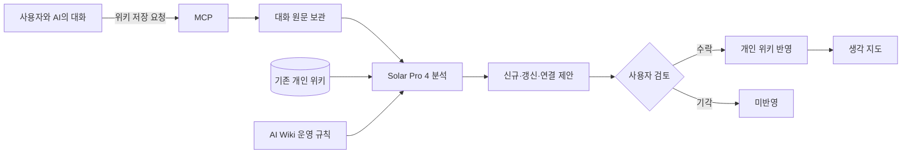

# Nodus

> 흩어진 AI 대화를 다시 꺼내 쓸 수 있는 개인 위키로

Nodus는 AI와 나눈 대화를 읽고 주제별 위키와 생각 지도로 정리해 주는 개인 지식 관리 서비스입니다.

사용자가 대화 중 저장을 요청하면 MCP를 통해 대화가 Nodus로 전달되고, Solar Pro 4가 기존 위키와 비교하여 새로운 위키 생성, 기존 내용 갱신, 위키 간 연결을 제안합니다.

AI가 만든 결과는 즉시 반영되지 않습니다. 사용자가 원문 근거와 변경 내용을 확인하고 수락한 결과만 실제 위키와 생각 지도에 반영됩니다.

## 배포 주소

- 서비스: [Nodus 바로가기](https://mabc-aiwiki.vercel.app)
- 현재 MVP는 공용 데모 계정을 통해 체험할 수 있습니다.

## 핵심 문제

AI와 나눈 대화에는 아이디어, 결정, 계획, 학습 내용이 쌓이지만 시간이 지나면 다시 찾거나 활용하기 어렵습니다.

직접 정리하는 데에는 시간이 들고, 단순 대화 기록만 보관해서는 과거의 생각과 현재의 맥락을 연결하기 어렵습니다.

Nodus는 대화를 자동으로 구조화하면서도 최종 반영 여부는 사용자가 결정하도록 설계했습니다.

## 핵심 기능

### MCP 기반 대화 수집

사용자가 AI에게 위키 저장을 요청하면 필요한 대화 구간이 MCP를 통해 Nodus로 전달됩니다.

자동으로 모든 대화를 수집하지 않으며, 사용자의 명시적인 저장 요청이 있을 때만 동작합니다.

### Solar Pro 4 기반 위키 제안

Solar Pro 4가 새로운 대화와 기존 위키를 함께 분석하여 다음 작업을 제안합니다.

- 새로운 위키 생성
- 기존 위키 내용 갱신
- 관련 위키 간 연결
- 대화에서 발견된 관심사 정리
- 제안의 이유와 원문 근거 생성

### 사용자 승인 기반 반영

AI의 분석 결과는 바로 위키에 반영되지 않고 제안함에 저장됩니다.

사용자는 제안 상세 화면에서 다음 내용을 확인할 수 있습니다.

- 변경 전후 내용
- 제안이 생성된 이유
- 제안의 근거가 된 원문
- 연결할 위키와 관계 유형

수락한 제안만 위키에 반영되며, 기각한 제안은 실제 위키에 반영되지 않습니다.

### 개인 위키

수락된 정보는 주제별 위키 노드로 축적됩니다.

각 위키에는 제목, 요약, 본문, 주제, 태그, 분류 정보와 변경 이력이 저장됩니다. 같은 주제의 대화가 다시 들어오면 새로운 문서를 계속 만드는 대신 기존 위키의 갱신 제안으로 이어질 수 있습니다.

### 생각 지도

사용자가 승인한 위키와 관계를 그래프로 시각화합니다.

생각 지도를 통해 개별 기록이 어떤 주제와 연결되어 있는지 확인하고, 원하는 노드의 상세 내용으로 이동할 수 있습니다.

### 통합 검색

승인된 위키와 보관된 대화를 키워드로 검색할 수 있습니다.

검색 결과에서 관련 위키 또는 원본 대화로 이동하여 과거의 맥락을 다시 확인할 수 있습니다.

### MCP 연결 관리

사용자는 서비스 안에서 개인 MCP 연결 토큰을 발급하고 폐기할 수 있습니다.

발급된 토큰과 MCP 서버 주소를 타임리의 MCP 설정에 등록하면 대화 중 Nodus 위키 저장 기능을 사용할 수 있습니다.

## 서비스 이용 흐름

1. Nodus의 MCP 연결 화면에서 연결 이름을 입력하고 토큰을 발급합니다.
2. MCP 서버 주소와 발급된 토큰을 타임리의 MCP 설정에 등록합니다.
3. AI와 대화하다가 “이 내용을 위키에 저장해줘”라고 요청합니다.
4. 필요한 대화 구간이 MCP를 통해 Nodus로 전달됩니다.
5. Solar Pro 4가 기존 위키와 새로운 대화를 비교하여 제안을 생성합니다.
6. 사용자가 제안의 변경 내용과 원문 근거를 확인합니다.
7. 수락된 내용만 개인 위키와 생각 지도에 반영됩니다.

## 핵심 원칙

### 명시적 요청이 있을 때만 저장

Nodus는 사용자가 저장을 요청한 대화만 전달받습니다.

대화 종료 시 자동 전송하거나 사용자의 요청 없이 대화를 수집하지 않습니다.

### AI는 제안하고 사용자가 결정

AI가 생성한 신규 위키, 갱신 내용, 연결 관계는 모두 제안 상태로 저장됩니다.

사용자의 승인 전에는 실제 위키를 변경하지 않습니다.

### 원문 근거 제공

각 제안에는 판단의 근거가 된 대화 원문이 함께 저장됩니다.

사용자는 결과만 보는 것이 아니라 왜 해당 제안이 생성되었는지 확인한 뒤 반영 여부를 결정할 수 있습니다.

### 사용자별 데이터 분리

로그인 세션과 사용자 식별 정보를 기준으로 대화, 위키, 제안, 관계 및 MCP 연결 토큰을 분리합니다.

## 시스템 구조



## 기술 스택

| 영역 | 기술 |
|---|---|
| Frontend | React, TypeScript, Vite, React Router, Three.js |
| Backend | Node.js, Express, TypeScript |
| Database | PostgreSQL, Prisma |
| AI | Solar Pro 4, Upstage API |
| Integration | Model Context Protocol |
| Authentication | Express Session, PostgreSQL Session Store |
| Deployment | Vercel, Render |

## 프로젝트 구조

```text
mabc_aiwiki
├── client
│   └── src
│       ├── components
│       ├── pages
│       └── services
├── server
│   ├── prisma
│   │   └── schema.prisma
│   └── src
│       ├── middleware
│       ├── routes
│       ├── search
│       ├── services
│       └── resources
├── mcp_server
│   ├── mcp_server
│   └── docs
├── session-graph
├── shared
└── docs
    ├── PRD-TEMPLATE.md
    ├── ai-wiki-SKILL.md
    ├── design.md
    └── design-2.md
```
## 주요 문서

- [제품 요구사항 문서](docs/PRD-TEMPLATE.md)
- [AI 위키 운영 규칙](docs/ai-wiki-SKILL.md)
- [서비스 디자인 문서](docs/design.md)
- [MCP 연동 문서](mcp_server/docs/INTEGRATION.md)

## MVP 범위

현재 MVP는 다음 기능을 제공합니다.

- MCP를 통한 사용자 요청 기반 대화 전달
- 대화 원문 보관
- Solar Pro 4 기반 위키 생성 제안
- 기존 위키 갱신 제안
- 위키 간 관계 연결 제안
- 제안 이유와 원문 근거 확인
- 제안 수락 및 기각
- 승인된 위키와 관계의 영구 저장
- 개인 위키 목록 및 상세 조회
- 생각 지도 시각화
- 위키 및 보관 대화 검색
- 사용자별 MCP 연결 토큰 발급과 폐기

다음 기능은 현재 MVP 범위에 포함하지 않습니다.

- 사용자 요청 없는 대화 자동 수집
- AI 판단만으로 위키에 자동 반영
- 팀 단위 공동 위키
- 벡터 기반 의미 검색
- 완전 자동화된 지식 그래프 스키마 구축

## 보안 및 데이터 처리 원칙

- 사용자가 명시적으로 저장을 요청한 대화만 MCP를 통해 전달합니다.
- AI가 생성한 내용은 사용자 승인 전까지 실제 위키에 반영하지 않습니다.
- 대화, 위키, 제안 및 연결 정보는 사용자별로 분리합니다.
- MCP 연결 토큰은 원문이 아닌 해시 형태로 저장합니다.
- 폐기된 MCP 토큰은 더 이상 대화 전송에 사용할 수 없습니다.
- API 키와 운영 환경변수는 저장소에 포함하지 않습니다.

## 프로젝트 정보

본 프로젝트는 MABC 2026 결선 출품을 위해 개발한 MVP입니다.
